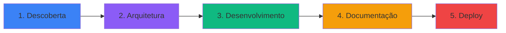

<div align="center">
  
# 👋 Olá, sou Mayko Barbosa

### Desenvolvedor Full Stack Sênior | Líder Técnico
### Node.js • React • TypeScript • Microserviços

[](https://portifolio-mayko-barbosa.vercel.app/)
[](https://www.linkedin.com/in/mayko-barbosa-61b93a210/)
[](mailto:barbosa.mayko@gmail.com)
[](https://wa.me/5598991363018)


</div>

---

## 🚀 Sobre Mim

Desenvolvedor Full Stack com **6+ anos** liderando arquiteturas escaláveis em **Node.js/NestJS** e **React/React Native**. Especializado em sistemas de alta disponibilidade para setores governamental e privado.

- 🔭 Atualmente trabalhando em **sistemas críticos de segurança pública** na PM-MA
- 🌱 Especialista em **microserviços, integrações financeiras e performance otimizada**
- 💬 Pergunte-me sobre **Node.js, React, TypeScript, Docker, API documentation**
- 📫 Entre em contato: **barbosa.mayko@gmail.com**
- ⚡ **10k+ transações/mês** | **99,8% uptime** | **$100k+ processados**
- 🌍 São Luís, MA - Brasil (Aberto a remoto/relocação)

---

## 💼 Destaques Profissionais

```yaml
Experiência:
  - Líder Técnico: "Polícia Militar do Maranhão (2019-Presente)"
  - Full Stack Developer: "CodeLabs USA (2023-2025)"
  - Front-end Developer: "3a/DevToYou (2022-2023)"

Impacto Mensurável:
  - "10k+ transações mensais processadas"
  - "$100k+ em integrações de pagamento"
  - "150+ usuários simultâneos em sistemas real-time"
  - "40% de redução no tempo de resposta de APIs"
  - "35% de redução em tickets de suporte"
  - "99,8% de uptime em sistemas críticos"

Especialidades:
  - Arquitetura de Microserviços
  - Integrações de Pagamento (Stripe, Mercado Pago)
  - Sistemas Real-time (Firebase, WebSockets)
  - Documentação Técnica (Swagger/OpenAPI)
  - Otimização de Performance (Redis, Caching)
```

---

## 🛠️ Stack Tecnológica

### Back-End


### Front-End


### Database & Cache


### DevOps & Cloud


### Integrações & Ferramentas


---

## 📊 GitHub Statistics

<div align="center">
  


</div>

---

## 🏆 Projetos em Destaque

### 🔐 Sistema de Gestão de Inteligência (PM-MA)
**Aplicação crítica para coordenação de atividades de inteligência policial e análise de organizações criminosas.**

**Impacto:**
- 150+ usuários simultâneos
- 99,8% de uptime
- Análise em tempo real
- Geolocalização integrada

**Stack:** Node.js, React, Vite.js, Google Maps API, Docker, Redis, Firebase

---

### 💰 Sistema de Administração para Construção Civil (CodeLabs)
**Plataforma SaaS completa com gestão de orçamentos, projetos e pagamentos integrados.**

**Impacto:**
- $100k+ em transações mensais
- Conformidade PCI-DSS
- Multi-tenancy
- Performance <800ms

**Stack:** Node.js, React, Vite.js, Stripe API, Docker, PostgreSQL, Redis

---

### 🎨 Landing Pages de Alta Conversão (DevToYou)
**Interfaces responsivas com foco extremo em performance e taxa de conversão.**

**Impacto:**
- 18% aumento na conversão
- 30% redução no FCP
- Deploy em 4min (antes: 15min)

**Stack:** React.js, Next.js, Tailwind CSS, GitHub Actions, Vercel

---

## 📈 Activity Graph

[](https://github.com/maykobarbosa)

---

## 🎯 Processo de Trabalho



1. **Descoberta** - Elicitação de requisitos com equipes multidisciplinares
2. **Arquitetura** - Design de sistemas escaláveis e manuteníveis
3. **Desenvolvimento** - Código limpo, testável e bem estruturado
4. **Documentação** - Swagger/OpenAPI + guias de usuário completos
5. **Deploy** - CI/CD automatizado com monitoramento contínuo

---

## 📚 Experiência Profissional

### 💼 Líder Técnico & Desenvolvedor Full Stack
**Polícia Militar do Maranhão** • *Jan/2019 - Presente*

- Liderou arquitetura de **4 sistemas críticos** processando 10k+ transações/mês
- Reduziu tempo de resposta de APIs em **40%** com microserviços + Redis
- Documentação completa reduziu tickets de suporte em **35%**
- Integrou sistemas real-time para **150+ usuários simultâneos**

### 💼 Desenvolvedor Full Stack & Arquiteto de Soluções
**CodeLabs USA** • *Jul/2023 - Jul/2025*

- Integrou gateways de pagamento processando **$100k+ mensais**
- Otimizou performance de dashboards de **3s para <800ms**
- Criou documentação técnica completa via Swagger

### 💼 Desenvolvedor Front-end
**3a/DevToYou** • *Mar/2022 - Jun/2023*

- Aumentou conversão em **18%** com A/B testing
- Reduziu FCP em **30%** via code splitting
- Automatizou CI/CD reduzindo deploy de **15min para 4min**

---

## 🎓 Formação

**Bootcamp Ignite** - Rocketseat (2021)  
Formação completa em Node.js, React e React Native

**Ciência da Computação** - Faculdade Pitágoras (2011-2015)  
Foco em Algoritmos, Estruturas de Dados e Bancos de Dados

---

## 🤝 Vamos Conectar?

Estou sempre aberto a discussões sobre projetos interessantes, oportunidades de colaboração ou apenas bater um papo sobre tecnologia!

- 💼 **Aberto para:** Tech Lead, Senior Full Stack, Remoto/Internacional
- 🌍 **Localização:** São Luís, MA - Brasil (Aberto a relocação)
- 📧 **Email:** barbosa.mayko@gmail.com
- 📱 **WhatsApp:** (98) 99136-3018
- 💻 **Portfolio:** [portifolio-mayko-barbosa.vercel.app](https://portifolio-mayko-barbosa.vercel.app/)

---

<div align="center">

### 💡 "Código limpo, arquitetura sólida, resultados mensuráveis."


**⭐ Se você gostou do meu trabalho, considere deixar uma estrela nos repositórios!**

</div>
